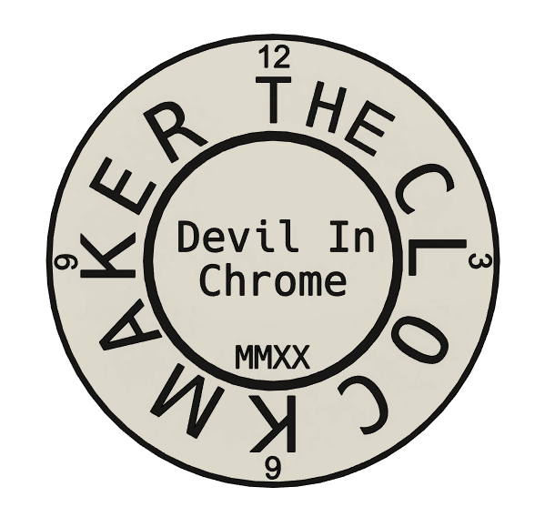

!!! todo "TODO: Most of this site"
    This site is largely under construction. It is a reference work, so I am sharing what is already complete.

    - [x] Electrical (in progress)
    - [ ] Tools and Resources
    - [ ] Environmental
    - [ ] Materials

## Background

{ align="right" width="200"}

Compared to PLA and PETG, engineering plastics (e.g., ABS, PA, and PC) are more prone to warping as they cool. These typically require an enclosure to print and some engineering plastics also need high ambient temperatures.

Most 3D printers are not sold enclosed and require modification to operate within one. Electronics are not usually tolerant of high heat; a basic enclosure without ventilation can reach 45C/113F.

Moving electronics away from the printer (and out of an enclosure) requires extension or replacement of the printer's wiring harness. This is a time-consuming and meticulous task to do, and harder to do safely.

!!! todo "TODO"

    - Fire risk
    - Off-gassing

## The Clockmaker Project

Enter The Clockmaker Project. More toolbox than blueprint, this project collects information about on how to build an enclosed printer:

- Air filtration and Ventilation
- Temperature monitoring
- Electrical wiring & connectors
- Insulation
- Links to outside resources

Additionally, the associated git repository has printable files to help build your own enclosure.

## Navigation

[cards cols=3(docs/assets/navlinks.yaml)]
