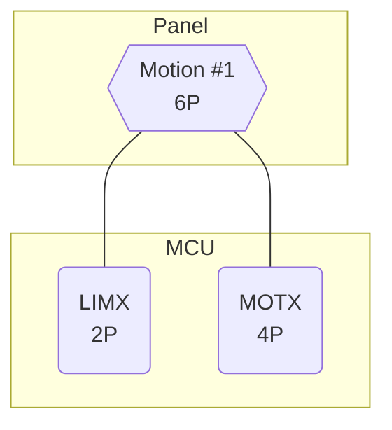
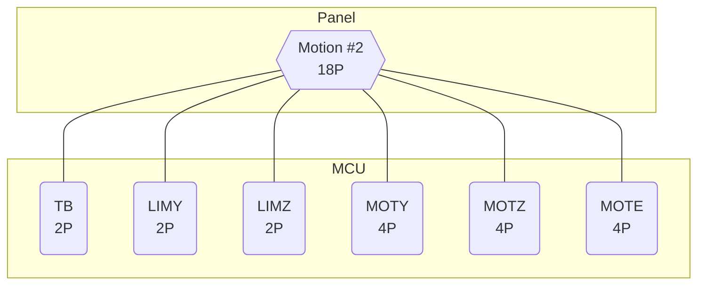
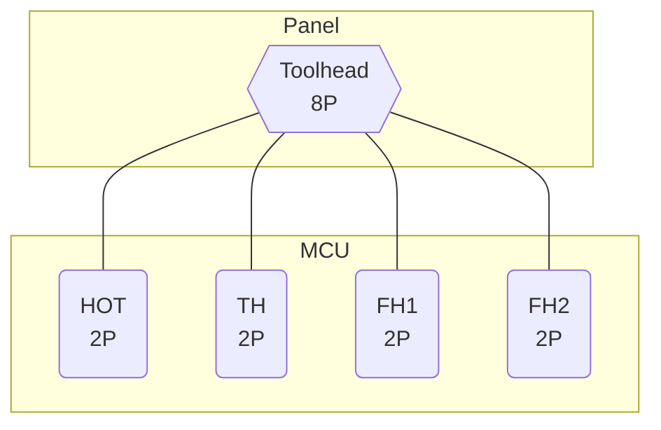

--8<-- "include/electrical_disclaimer.md:crimp"

??? note "Reading Entries"
    - `Name`: an abbreviation for what the pin does. This is for identification only.
    - `Pin #`: order of the pin in the connector.
    - `Color`: optional color-coding for the wire insulation.
        - Colors are solely to help visual identification.
        - Colors do not always match the wire colors that usually tail a component; this is meant to maintain internal consistency.

    See the [tips](panel_tips.md) page for details.

Composite connectors may not be the technical term for connectors with pins that lead to multiple endpoints, but I have not found the correct one.

### X Limit Switch and Stepper

| Pin #  | Name     | Color             |  Color             | Name     | Pin #   |
|:------:|:--------:|:-----------------:|:------------------:|:--------:|:-------:|
| **1**  | LIMX SIG | Y :yellow_circle: | W ![white][white]  | LIMX GND | **4**   |
| **2**  | MOTX 1A  | R :red_circle:    | G :green_circle:   | MOTX 2A  | **5**   |
| **3**  | MOTX 1B  | B :blue_circle:   | K ![black][black]  | MOTX 2B  | **6**   |

### Y, Z, Extruder, and Bed

| Pin #  | Name     | Color             |  Color             | Name     | Pin #   |
|:------:|:--------:|:-----------------:|:------------------:|:--------:|:-------:|
| **1**  | TB SIG   | Y :yellow_circle: | W ![white][white]  | TB GND   | **10**   |
| **2**  | LIMY SIG | Y :yellow_circle: | W ![white][white]  | LIMY GND | **11**  |
| **3**  | LIMZ SIG | Y :yellow_circle: | W ![white][white]  | LIMZ GND | **12**  |
| **4**  | MOTY 1A  | R :red_circle:    | G :green_circle:   | MOTY 2A  | **13**  |
| **5**  | MOTY 1B  | B :blue_circle:   | K ![black][black]  | MOTY 2B  | **14**  |
| **6**  | MOTZ 1A  | R :red_circle:    | G :green_circle:   | MOTZ 2A  | **15**  |
| **7**  | MOTZ 1B  | B :blue_circle:   | K ![black][black]  | MOTZ 2B  | **16**  |
| **8**  | MOTE 1A  | R :red_circle:    | G :green_circle:   | MOTE 2A  | **17**  |
| **9**  | MOTE 1B  | B :blue_circle:   | K ![black][black]  | MOTE 2B  | **18**  |

### Toolhead

| Pin #  | Name     | Color             |  Color             | Name     | Pin #   |
|:------:|:--------:|:-----------------:|:------------------:|:--------:|:-------:|
| **1**  | HOT VIN  | R :red_circle:    | K ![black][black]  | HOT GND  | **5**   |
| **2**  | FH1 VIN  | R :red_circle:    | K ![black][black]  | FH1 GND  | **6**   |
| **3**  | FH2 VIN  | R :red_circle:    | K ![black][black]  | FH2 GND  | **7**   |
| **4**  | TH SIG   | Y :yellow_circle: | W ![white][white]  | TH GND   | **8**   |

[black]: ../img/black_circle.png
[white]: ../img/white_circle.png