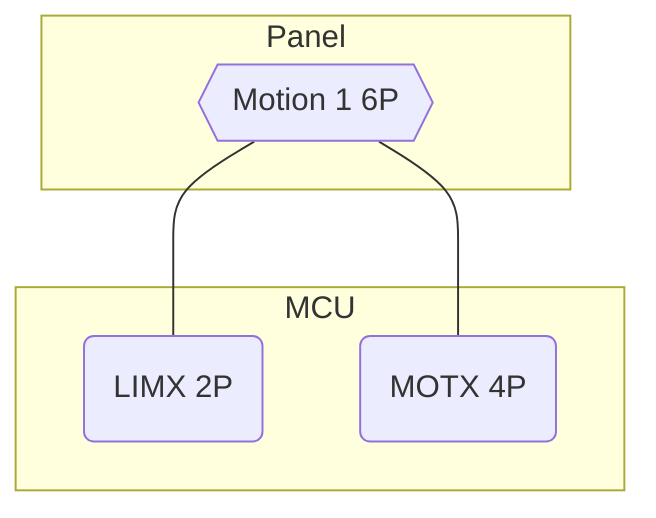
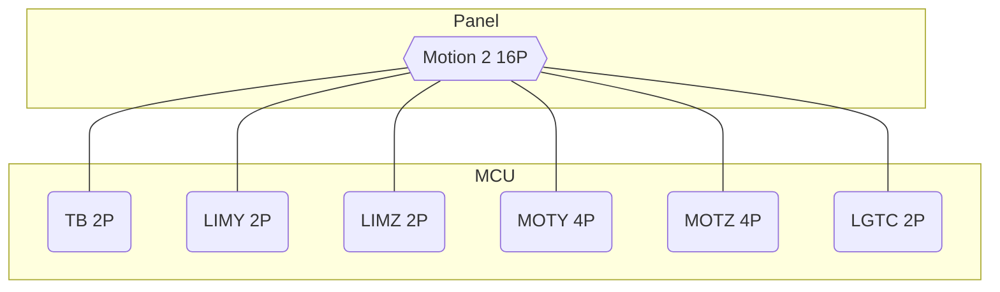
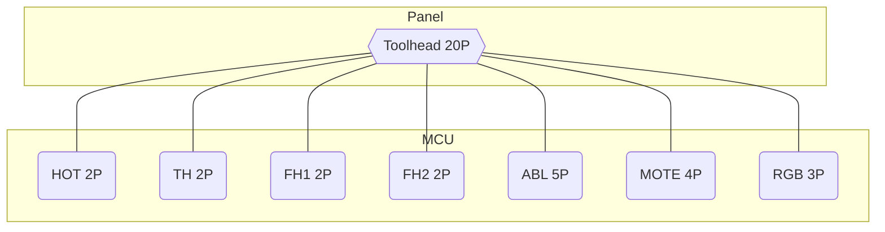
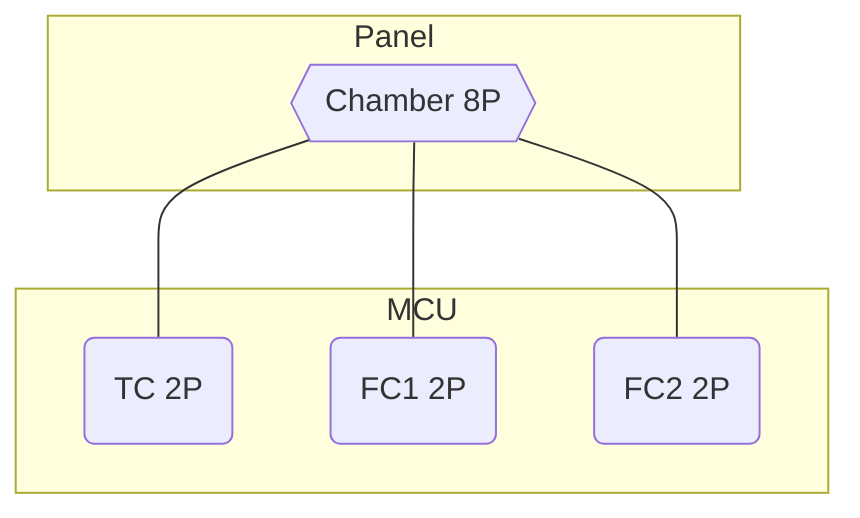

--8<-- "include/electrical_disclaimer.md:crimp"

??? note "Reading Entries"
    - `Name`: an abbreviation for what the pin does. This is for identification only.
    - `Pin #`: order of the pin in the connector.
    - `Color`: optional color-coding for the wire insulation.
        - Colors are solely to help visual identification.
        - Colors do not always match the wire colors that usually tail a component; this is meant to maintain internal consistency.

    See the [tips](panel_tips.md) page for details.

This is a more complicated example of an enclosed Ender 5. It has the following differences from the previous example:

- Direct drive (MOTE is in the toolhead bundle)
- BLTouch (ABL)
- 3-pin RGB toolhead lights (RGBH)
- Enclosure thermistor (TC)
- 2-pin enclosure fans (FC1, FC2)
- 2-pin enclosure LED lights (LGTC)

### X Limit Switch and Stepper

| Pin #  | Name     | Color             |  Color             | Name     | Pin #   |
|:------:|:--------:|:-----------------:|:------------------:|:--------:|:-------:|
| **1**  | LIMX SIG | Y :yellow_circle: | W ![white][white]  | LIMX GND | **4**   |
| **2**  | MOTX 1A  | R :red_circle:    | G :green_circle:   | MOTX 2A  | **5**   |
| **3**  | MOTX 1B  | B :blue_circle:   | K ![black][black]  | MOTX 2B  | **6**   |

### Y, Z, Bed, and Lights

| Pin #  | Name     | Color             |  Color             | Name     | Pin #   |
|:------:|:--------:|:-----------------:|:------------------:|:--------:|:-------:|
| **1**  | TB SIG   | Y :yellow_circle: | W ![white][white]  | TB GND   | **9**   |
| **2**  | LIMY SIG | Y :yellow_circle: | W ![white][white]  | LIMY GND | **10**  |
| **3**  | LIMZ SIG | Y :yellow_circle: | W ![white][white]  | LIMZ GND | **11**  |
| **4**  | MOTY 1A  | R :red_circle:    | G :green_circle:   | MOTY 2A  | **12**  |
| **5**  | MOTY 1B  | B :blue_circle:   | K ![black][black]  | MOTY 2B  | **13**  |
| **6**  | MOTZ 1A  | R :red_circle:    | G :green_circle:   | MOTZ 2A  | **14**  |
| **7**  | MOTZ 1B  | B :blue_circle:   | K ![black][black]  | MOTZ 2B  | **15**  |
| **8**  | LGTC VIN | R :red_circle:    | K ![black][black]  | LGTC GND | **16**  |

### Toolhead

| Pin #  | Name     | Color             |  Color             | Name     | Pin #   |
|:------:|:--------:|:-----------------:|:------------------:|:--------:|:-------:|
| **1**  | HOT VIN  | R :red_circle:    | K ![black][black]  | HOT GND  | **11**  |
| **2**  | FH1 VIN  | R :red_circle:    | K ![black][black]  | FH1 GND  | **12**  |
| **3**  | FH2 VIN  | R :red_circle:    | K ![black][black]  | FH2 GND  | **13**  |
| **4**  | MOTE 1A  | R :red_circle:    | G :green_circle:   | MOTE 2A  | **14**  |
| **5**  | MOTE 1B  | B :blue_circle:   | K ![black][black]  | MOTE 2B  | **15**  |
| **6**  | RGBH VIN | R :red_circle:    | Y :yellow_circle:  | RGBH SIG | **16**  |
| **7**  | RGBH GND | K ![black][black] | W ![white][white]  | ABL GND  | **17**  |
| **8**  | ABL SIG  | Y :yellow_circle: | G :green_circle:   | ABL PWM  | **18**  |
| **9**  | ABL GND  | K ![black][black] | B :blue_circle:    | ABL VIN  | **19**  |
| **10** | TH SIG   | Y :yellow_circle: | W ![white][white]  | TH GND   | **20**  |

### Chamber

Although only six (6) pins are used, we here we use an 8 position connector to avoid confusion with the X axis connector.

| Pin #  | Name     | Color             |  Color             | Name     | Pin #   |
|:------:|:--------:|:-----------------:|:------------------:|:--------:|:-------:|
| **1**  | TC SIG   | Y :yellow_circle: | W ![white][white]  | TC GND   | **5**   |
| **2**  | FC1 VIN  | R :red_circle:    | K ![black][black]  | FC1 GND  | **6**   |
| **3**  | FC2 VIN  | R :red_circle:    | K ![black][black]  | FC2 GND  | **7**   |
| **4**  | (Unused) | (N/A)             | (N/A)              | (Unused) | **8**   |

[black]: ../img/black_circle.png
[white]: ../img/white_circle.png